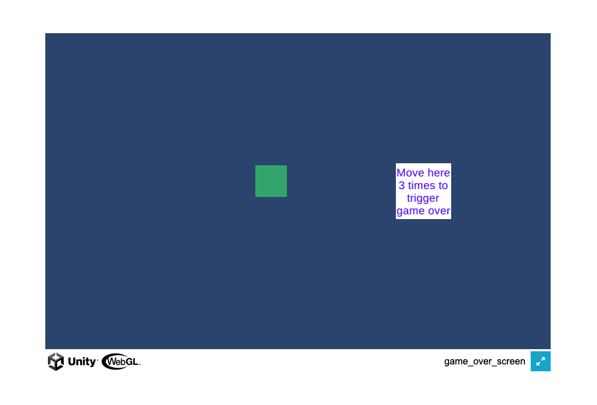
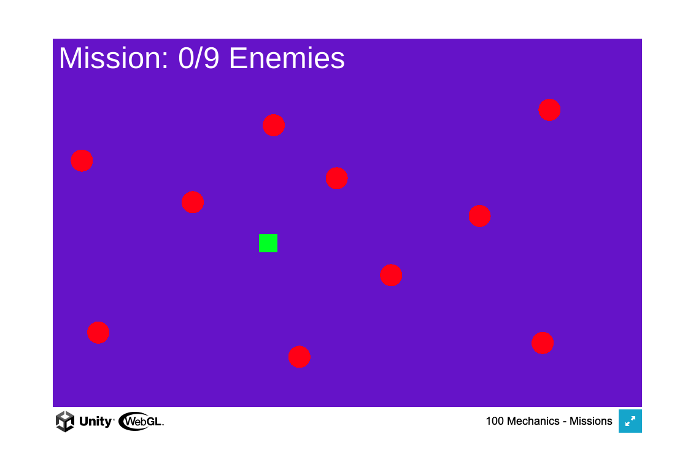
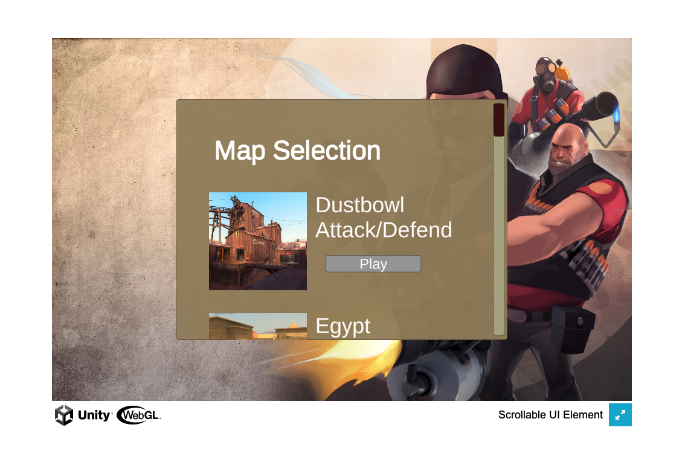
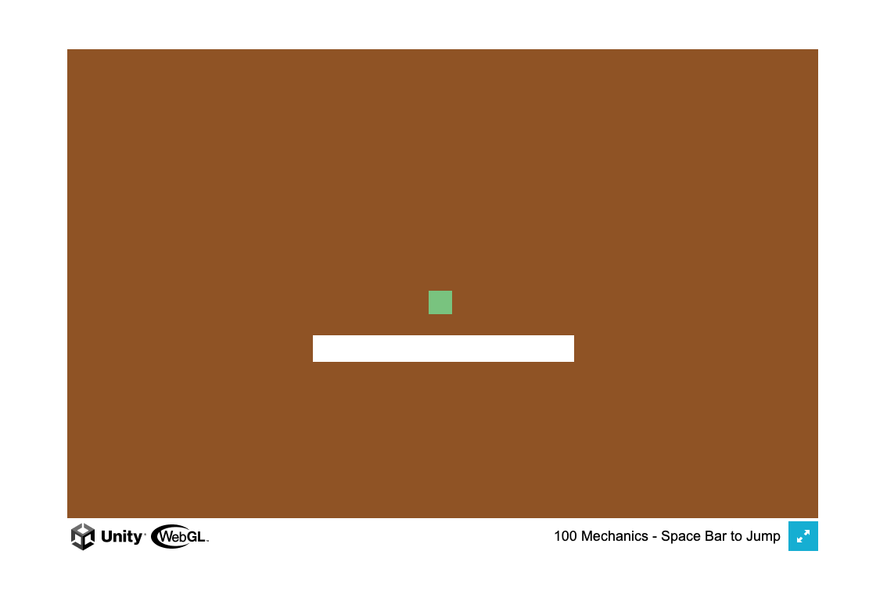
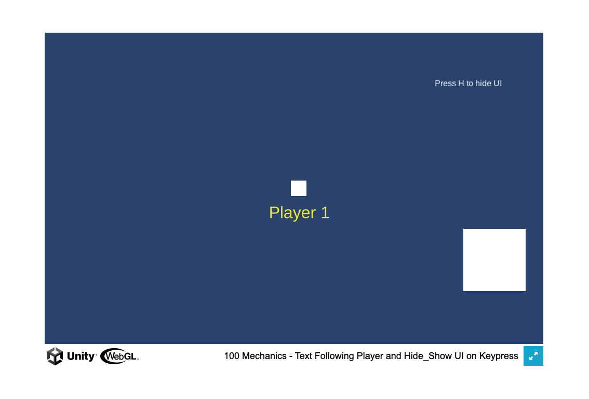

* Game Over Screen with Restart Button:
  * Modified the layer color and the Text color
  * Changed the conditions to 3 times collode to trigger game over screen 
  
  
* Missions: 
  * Changed the Enemies positions
  * Make the ingame text bigger
  * Changed the Player bullet speed to 10f and doubled the cooldown time
  
  
* Scrollable UI Element:
  * Modified the Panel and the PanelScrool color
  * Reposition the "Map Selection" title
  
  
* Space Double Jump:
  * Changed the background color and reposition the block to be in the middle
  
  
* Text Follow Player:
  * Moved the Text under player and changed the color to yellow 
  * Press H to hide UI instead of M 
  
